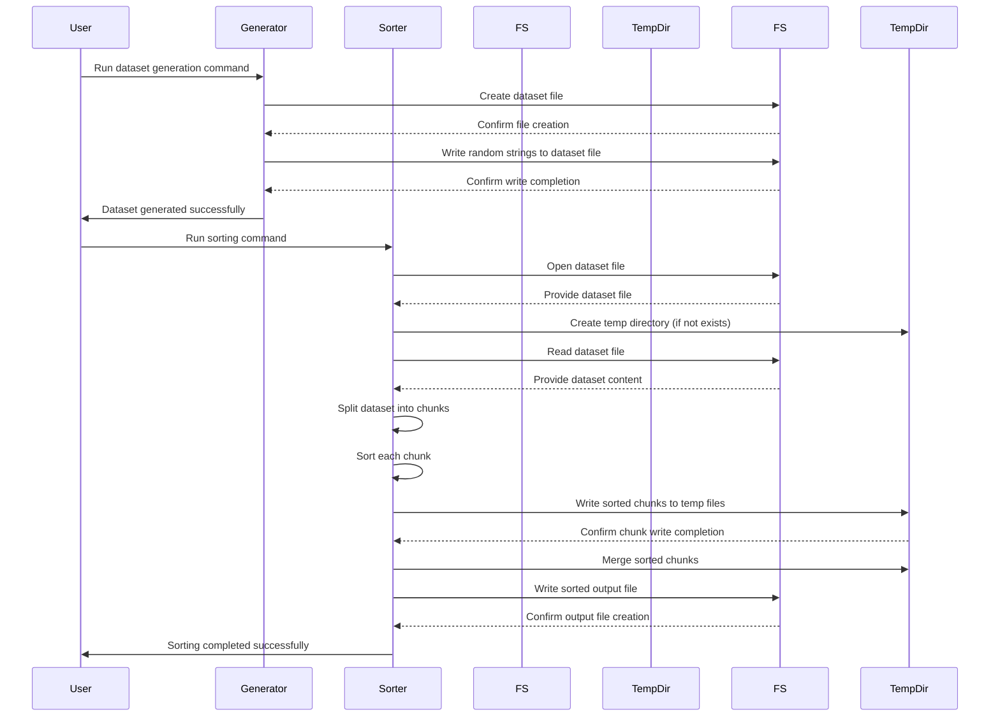

# External Sorting in Go

This project implements an external sorting algorithm in Go, capable of handling large datasets that exceed available memory. The program reads a dataset of random strings from a file, sorts them, and writes the sorted output to a new file. It includes a dataset generator that creates random strings for testing purposes.

## Table of Contents

- [External Sorting in Go](#external-sorting-in-go)
- [Features](#features)
- [Project Structure](#project-structure)
- [Requirements](#requirements)
- [Installation](#installation)
- [Build](#build)
  - [Simple Build](#simple-build)
  - [Optimized Build](#optimized-build)
  - [Cross-Compilation](#cross-compilation)
- [Usage](#usage)
  - [Generating a Dataset](#generating-a-dataset)
  - [Sorting the Dataset](#sorting-the-dataset)
- [How It Works](#how-it-works)
- [Sequence Diagram](#sequence-diagram)
- [Memory Management](#memory-management)
- [Contributing](#contributing)
- [License](#license)
  
## Features

- Generates a dataset of random strings.
- Implements external merge sort to handle large datasets.
- Uses a temporary directory for storing intermediate sorted chunks.
- Supports sorting of strings.

## Project Structure
    go_external_sort/
    │
    ├── cmd/main.go                
    │   ├── dataset/
    │        └── main.go        # Entry point of the program to generate dataset
    │   └── sort
    │        └── main.go        # Entry point of the program to sort dataset
    ├── sorter/
    │   ├── sorter.go          # External sorting logic
    │   └── merge.go           # Merging sorted chunks
    └── utils/
        ├── file.go            # File handling utilities
        └── logger.go          # Logging utilities

## Requirements

- Go 1.22.3 or later

## Installation

1. Clone the repository:
```bash
git clone https://github.com/fajarnugraha37/go_external_sort.git 
cd go_external_sort
```

2. Ensure you have Go installed on your machine. You can download it from [golang.org](https://go.dev/dl/).

## Build

### Simple Build

To build the project for development, you can use the following command:
```bash
go build -o ./bin/dataset.exe ./cmd/dataset/main.go
go build -o ./bin/sort.exe ./cmd/sort/main.go
```
This command compiles the code and creates executables in the bin directory.

### Optimized Build

For a optimized-optimized build, you can use the following command:
```bash
go build -o ./bin/dataset.exe -ldflags="-s -w" ./cmd/dataset/main.go
go build -o ./bin/sort.exe -ldflags="-s -w" ./cmd/sort/main.go
```
- `-ldflags="-s -w"`: This flag reduces the size of the binary by omitting the symbol table and debug

### Cross-Compilation

If you are on a different operating system and want to cross-compile for another OS, you can set the `GOOS` and `GOARCH` environment variables accordingly.

## Usage

### Generating a Dataset

To generate a dataset of random strings, use the following command:
```bash
go run ./cmd/dataset/main.go -output dataset_input.txt -count 10000000 -length 16
```
or
```bash
./bin/dataset.exe -output dataset_input.txt -count 10000000 -length 16
```
- `-output`: Path to the output file where the dataset will be saved.
- `-count`: Number of random strings to generate (default is 100,000).
- `-length`: Length of each random string (default is 10).

### Sorting the Dataset

To sort the generated dataset, use the following command:
```bash
go run ./cmd/sort/main.go -input dataset_input.txt -output dataset_output.txt
```
or
```bash
./bin/sort.exe -input dataset_input.txt -output dataset_output.txt
```
- `-input`: Path to the input file containing the dataset to be sorted.
- `-output`: Path to the output file where the sorted dataset will be saved.

## How It Works

1. **Dataset Generation**: The `./cmd/dataset/main.go` file generates a specified number of random strings and writes them to a file.
2. **External Sorting**: The `./cmd/sort/main.go` file orchestrates the sorting process:
   - It reads the dataset from the input file.
   - It splits the dataset into manageable chunks, sorts each chunk, and writes them to temporary files.
   - It merges the sorted chunks into a final sorted output file.
  
## Sequence Diagram


- `Participants`: The diagram includes five participants: User, Generator, Sorter, FileSystem, and TempDirectory.
- `Interactions`: The arrows represent the interactions between these participants, showing the flow of commands and responses during the dataset generation and sorting processes.

## Memory Management

The program is designed to use minimal memory by:
- Limiting the size of each chunk to 10 MB.
- Using buffered I/O for efficient file operations.
- Storing temporary files in a dedicated `temp` directory within the working directory.

## Contributing

Contributions are welcome! If you have suggestions or improvements, feel free to open an issue or submit a pull request.

## License

This project is licensed under the MIT License. See the [LICENSE](LICENSE) file for details.
